# 🖼️🤖 Tutorial : get started with YOLO and Panoramax !

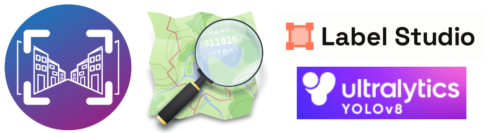

Welcome on this tutorial ! This tutorial will guide you through the process of creating a custom object detection model for street images coming from Panoramax, using YOLOv8 and Label Studio. The tutorial will help you through:

- Find known object locations by querying __OpenStreetMap__
- Collect nearby pictures using __Panoramax__
- Annotate pictures using __Label Studio__
- Train a detection model with __YOLOv8__
- Detect objects in Panoramax images

We will also explore the re-training process based on false positives and offers insights into refining the model. The goal is to make you as autonomous and empowered on object detection by understanding the complete workflow.

## 🌐 The big picture

[YOLOv8](https://docs.ultralytics.com/), or _You Only Look Once (version 8)_, is a powerful and efficient object detection algorithm widely utilized in computer vision applications. It builds upon the success of its predecessors, offering improved accuracy and speed in real-time object detection tasks. YOLOv8 is particularly notable for its ability to detect and classify objects within images or video frames swiftly and accurately. Developed with a focus on simplicity and effectiveness, YOLOv8 employs a single neural network to simultaneously predict bounding boxes and class probabilities for multiple objects in a given scene.

Pictures annotation will be essential in this process. It's mainly teaching the algorithm what the features you're searching look like. We need to tell with many examples "This is a car, and it's right there in the picture". To do so, we draw over the picture many rectangles to spot objects, and assign to each of them a label (or class) to distinguish various features in a single image.

But before annotating pictures, we need actual pictures showing features we're searching for. We will use here both [OpenStreetMap](https://www.openstreetmap.org/) and [Panoramax](https://panoramax.fr/) to find useful pictures. OpenStreetMap (OSM) stands as a global collaborative mapping project, often referred to as the _Wikipedia of maps_. It serves as an extensive geographic database where contributors from around the world can actively participate in improving and updating mapping data. OSM allows anyone to contribute by adding or modifying geographic information, making it a valuable resource for accessing detailed and up-to-date spatial data. So, first we will extract position of features we want in OpenStreetMap, then request Panoramax to have pictures showing the wanted feature.

With this example set of pictures, we could start annotating. [Label Studio](https://labelstud.io/) is an open-source software designed for data labeling and annotation tasks. It serves as a comprehensive tool for efficiently labeling diverse datasets, including images, text, and audio. With Label Studio, users can create labeled datasets for training machine learning models. These datasets can then be exported to train a YOLO model.

Once we get a trained model from YOLO, we can run object detections on a larger scale, using Panoramax dataset. We will rely on Python script to browse through the catalog, launch YOLO, and export interesting pictures and a GeoJSON file with positions of pictures showing the detected features.

Now we have a clearer idea of the whole process, let's get started !

## 📷🗺️ Find pictures with Panoramax & OpenStreetMap

### Locating interesting features in OpenStreetMap

First, we need pictures showing a particular feature, to train our detection model. In the tutorial, we will work on searching __fire hydrants__ 🔥💧. To extract example locations of these objects, we will rely on OpenStreetMap data. In particular, we will use here a tool called [Overpass Turbo](https://overpass-turbo.eu/), which is an easy OSM data exporter.

The fastest way to get wanted data is by using the __Assistant__ button. In the popup, just type your search terms like:

> "fire hydrant" in Lyon

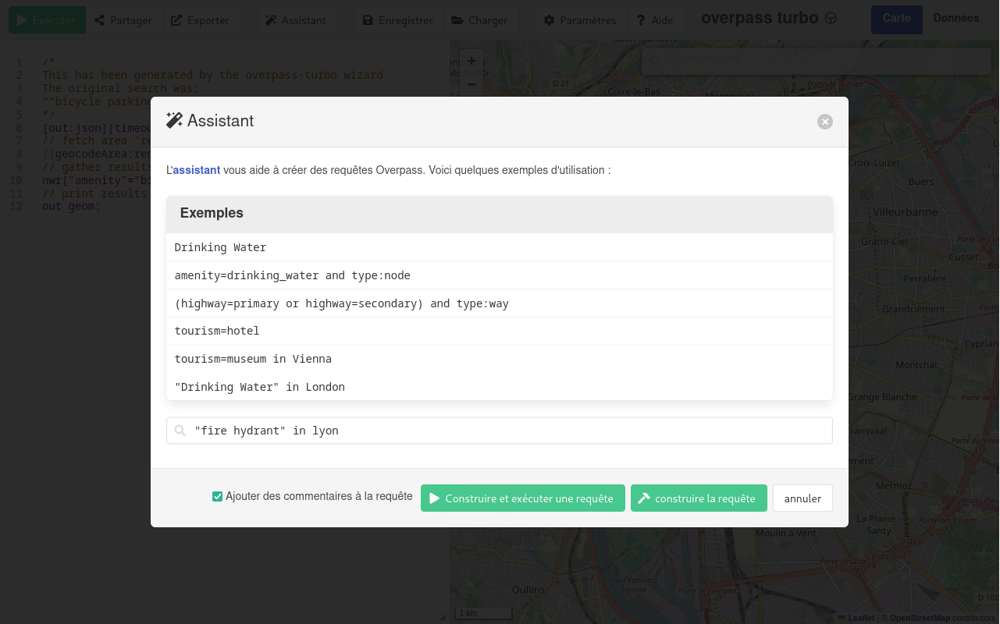

Then click on _Build and execute_, data will appear over the map.

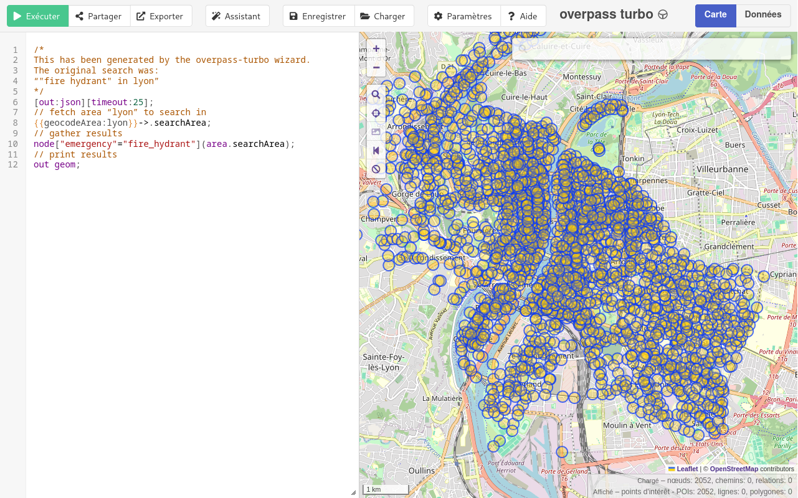

OpenStreetMap data can then be exported using __Export__ button. Save your file as _GeoJSON_ format. Note that if you run into any trouble during that step, an example file is also provided as [`osm_hydrants_lyon.geojson`](./osm_hydrants_lyon.geojson).

### Downloading nearby picture in Panoramax

The [Panoramax API](https://panoramax.ign.fr/api/docs/swagger#/Pictures/get_api_search) offers an endpoint to retrieve pictures looking at a specific object. For example, you can run a _HTTP GET_ query like:

```
https://panoramax.ign.fr/api/search?place_distance=2-10&place_position=4.8444928,45.7719378
```

That gives you pictures looking at given coordinates (longitude, latitude) in a GeoJSON format. First listed picture is the nearest match.

As we will need many pictures (at least 100), we can automate this process of looking for a picture at each hydrant position by using a Python script. This is what the [`find_pics.py`](./find_pics.py) file is for.

Let's prepare a bit our Python environment:

```bash
# Create a virtual environment
python -m venv env
source ./env/bin/activate

# Install dependencies
pip install -r requirements.txt
```

You can give a look at the [script](./find_pics.py), especially if you want to customize the input GeoJSON data:

```python
# The Panoramax API endpoint to use
PANORAMAX_API="https://panoramax.ign.fr/api"
# The GeoJSON input file
OSM_FEATURES="./osm_hydrants_lyon.geojson"
# How many pictures you want
WANTED_PICTURES=100
# Where to save pictures
PICTURES_OUTPUT_FOLDER="./training_pictures"
```

Once you're ready, you can launch it with:

```bash
python ./find_pics.py
```

It will first ask Panoramax if a picture exist around each hydrant position, and then download standard definition picture for each match.

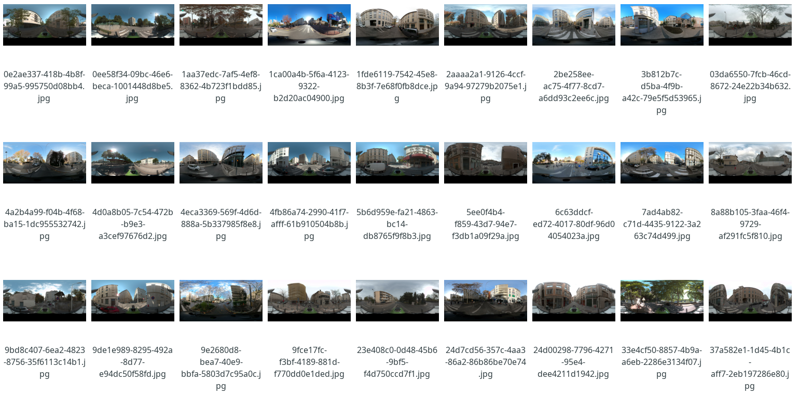

If you give them a look, most of them should depict a fire hydrant somewhere. Now, we're ready for labelling !

## 🏷️ Picture labelling with Label Studio

### Initial setup

[Label Studio](https://labelstud.io/) will help us annotating our pictures through an easy-to-use user interface. This should be already available in your Python environment, or you can give a look at [official install guide](https://labelstud.io/guide/start).

To launch Label Studio, just run:

```bash
label-studio
```

Label Studio is running at [`localhost:8080`](http://localhost:8080/).

The tool will ask you to register with an email and password. Once you have an account, the home page looks like:

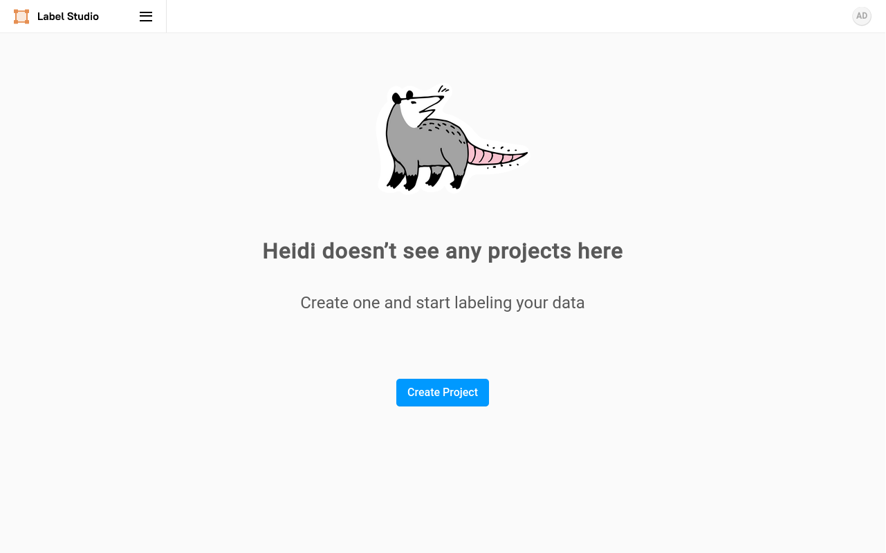

From there, we will create a new project. Give it a name like _Fire hydrants_ and a description.

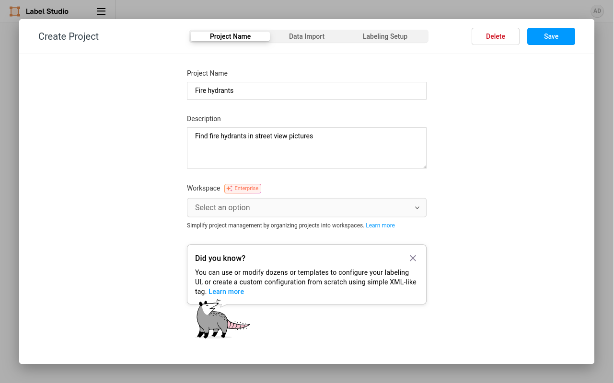

Go then to the _Labelling setup_ tab, here we choose _Computer vision_ category on the sidebar, and _Object detection with bounding boxes_. Note that Label Studio offer many other annotation possibilites.

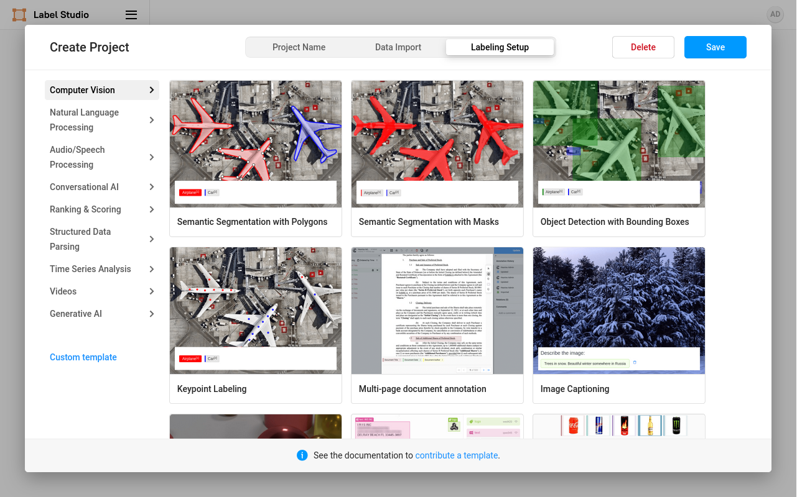

Then, we need to name our _labels_, the categories we will use for labelling pictures. As a start, we just create one label called `pillar` (a classic fire hydrant, the _red thingy_ we see in streets).

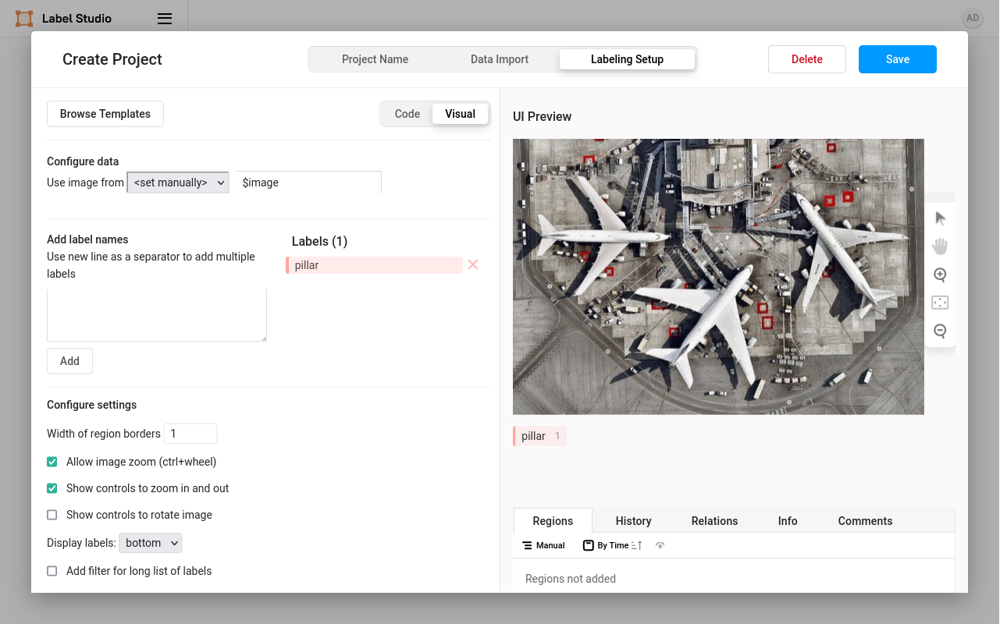

Then save the settings. It's time to load some pictures !

### Picture import

On the project main page, you can click on _Import_ button to start importing your pictures.

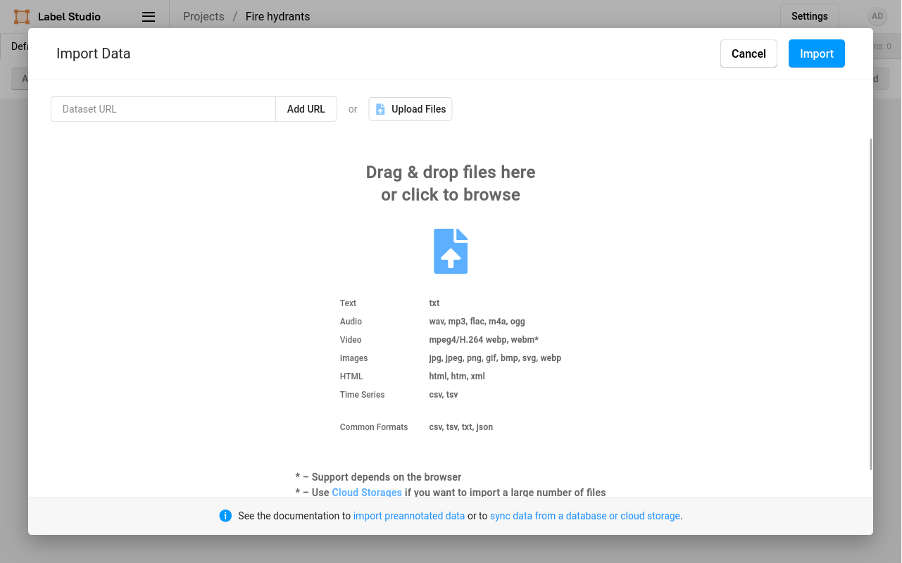

Select all the pictures downloaded from Panoramax (in the `training_pictures` folder) and click on _Import_. This could take a few seconds. They should now appear in the main project page.

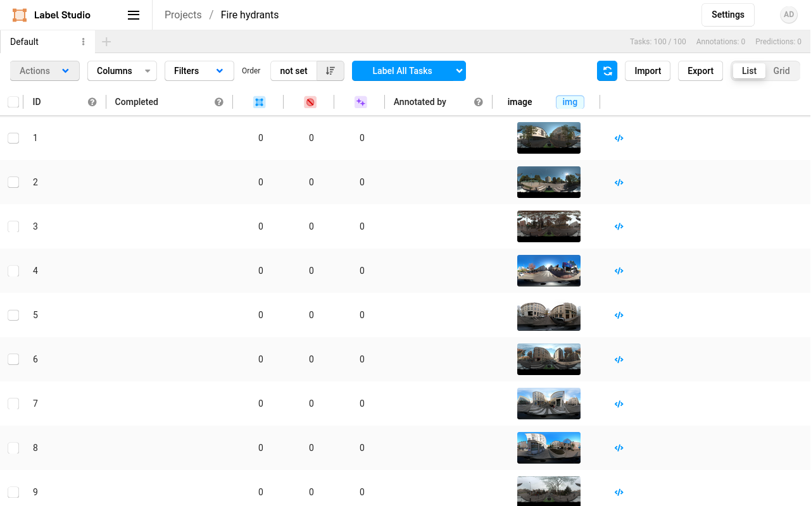

### Picture annotation

Next step is to label/annotate our pictures. Start by clicking on a picture in the list, that will display the annotation page for this picture.

You can add a label over the picture by clicking on _pillar_ button under the picture. Then, draw over the picture a rectangle to cover the fire hydrant. Try to make the rectangle as adjusted as possible.


Repeat this process for each object in the picture. Once everything is labelled in the picture, click on _Submit_ button in bottom-right corner.

And then, repeat the process for every picture you have imported. Yes I know, it's a bit _repetitive and boring_ ⏲️🥱 But this step is essential for a good model training. Like teachers in school, we need to spend a lot of time to prepare good courses for students.

### Dataset export

Once you're done with picture labelling, you can export your annotations using the _Export_ button in the project page. From here, choose the _YOLO_ export format. It will generate a ZIP archive that we will need for training the model.

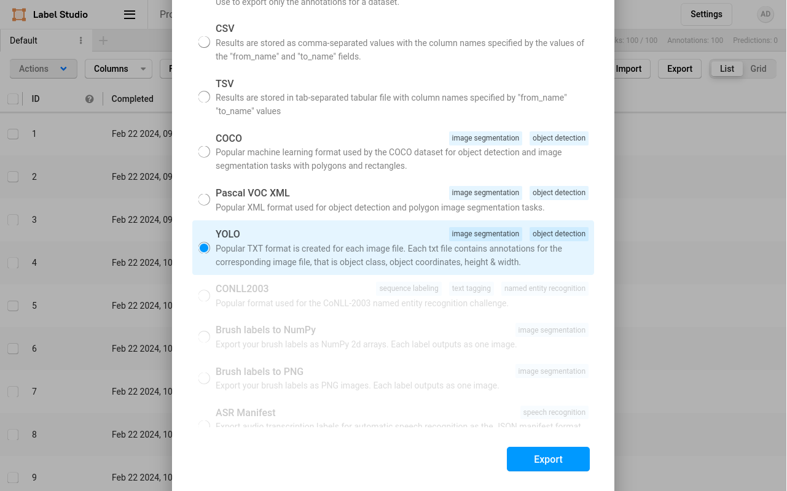

Before starting the training, we have to split the dataset between two subsets of pictures :

- __Training pictures__, which will be used to teach the model what to detect
- __Validation pictures__, which are used after teaching to check model accuracy

To have an optimal training, we may have 80% of training pictures, and 20% of validation pictures. To split our dataset, you can do the following :

- Extract a first time the exported ZIP, and name it as `hydrants_data_v1`. It will be our __training__ dataset.
  - Go in the extracted directory
  - Delete 20% of the images in `pictures` folder (make sure they're sorted by file name)
  - Delete same quantity of text files in the `labels` folder (same names as the deleted pictures)
- Extract a second time the exported ZIP, and name it as `hydrants_data_validation`. It will be our __validation__ dataset.
  - Go in the extracted directory
  - Delete 80% of the images in `pictures` folder (make sure they're sorted by file name)
  - Delete same quantity of text files in the `labels` folder (same names as the deleted pictures)

Our initial dataset is ready. It's time for YOLO to help us train our model.

## 🏃‍♀️ Model training with YOLO

### Setup

Before starting install, note that the tools we need use some disk space (like 6 Go), and will offer better performance if you have a _not-so-bad_ graphic card. Although, you can use the tooling with a classic processor (CPU), but model training could be a lot longer.

YOLO needs PyTorch to be installed to run smoothly. [Have a look at install documentation](https://pytorch.org/get-started/locally/) as it highly depends on your environment and hardware. The install command can look like:

```bash
pip install torch torchvision
```

Once PyTorch is available, you can [install YOLOv8](https://docs.ultralytics.com/quickstart/#install-ultralytics) with this command (or may be already available in your Python environment if you used `requirements.txt`):

```bash
pip install ultralytics
```

### Training our first model 👶

Here we are, ready to train our first object detection model with YOLO ! To do so, we need to extract the contents of the Label Studio ZIP export. You can name the extracted folder `hydrants_data_v1`.

In this folder, we need to add a little configuration file for YOLO. It should be named `data.yaml`, and have the following content:

```yaml
train: /path/to/hydrants_data_v1/images
val: /path/to/hydrants_data_validation/images
nc: 1
names: ['pillar']
```

You may need to change the content of the file:

- `train`: to match the file path to access the `images` folder inside your `hydrants_data_v1` directory
- `val`: to match the file path to access the `images` folder inside your `hydrants_data_validation` directory
- `names`: if you have used a different label name than `pillar`

Now we're ready to launch some training ! Note that your computer GPU will heat up a bit 🌡️ Launch the following command:

```bash
yolo detect train \
	data=./hydrants_data_v1/data.yaml \
	model=yolov8n.pt \
	project=hydrants_model_v1 \
	epochs=100 imgsz=2048
```

We're using here as a base model `yolov8n.pt` ([see all available models in docs](https://docs.ultralytics.com/models/yolov8/#supported-tasks-and-modes)), this could be tweaked for improving model performance.

Also note that the `imgsz=2048` parameter should correspond to the actual width of retrieved pictures. In the `find_pics.py` script we used, all pictures are downloaded with a fixed width of 2048 pixels. Don't forget to change the value here if you have different picture sizing.

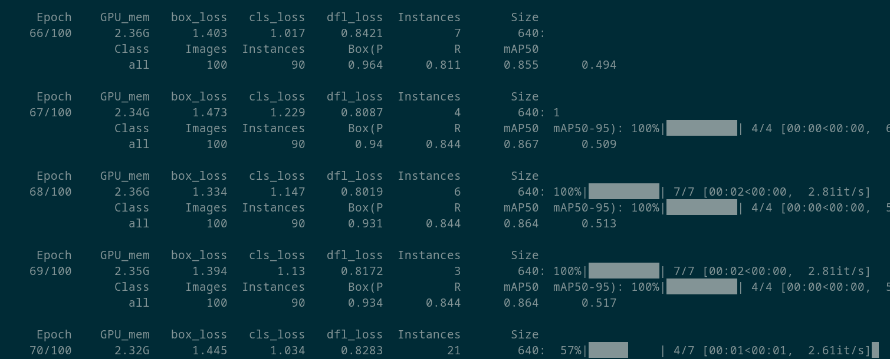

After a few minutes, a new folder named `hydrants_model_v1` should be available. Under the `train` sub-directory, you will find various interesting files to understand the results of model training.

As a first start, we will only keep an eye on `weights/best.pt` file. It's the generated weight file, it contains the learned parameters and weights of your trained model, enabling it to make accurate predictions/detections. In simpler words, it's __your trained model__ ! So let's try to use it.

### Using your model manually

To check if everything went smoothly, you can give a try to your model by manually running the following command, with a picture showing a fire hydrant:

```bash
yolo predict \
	project=hydrants_model_v1 \
	model=./hydrants_model_v1/train/weights/best.pt \
	source=./Images/pic_with_hydrant.jpg \
	imgsz=2048 save_txt=True
```

Congratulations, you've detected your first object with your model ! 🎆 Results will be available in `hydrants_model_v1/predict` folder.

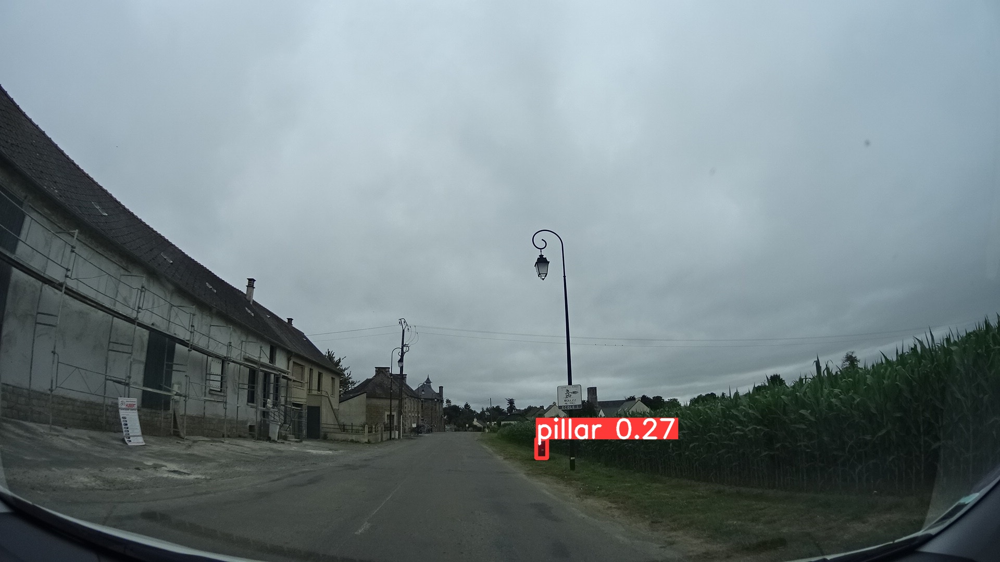

Note that the score appearing on the picture is evaluated between 0 and 1. It's a confidence score, how sure the model is about the detection. The higher, the better.

Now that our first model runs, let's automate to detect objects on a broader scale.

## 🔍 Detecting object on Panoramax images

We want to run this detection model on all images coming from Panoramax, in a particular area. This will allow us to have a list of positions where fire hydrants are visible in pictures, which could be helpful for many use cases.

This is done with the Python script named [`predict_pano.py`](./predict_pano.py). Give a look at it, especially if you want to change the settings:

```python
# The Panoramax API endpoint to use
PANORAMAX_API="https://panoramax.ign.fr/api"
# The search area (min X, min Y, max X, max Y)
SEARCH_BBOX=[2.25256,48.96895,2.26447,48.97247]
# Path to your trained model ".pt" file
MODEL_PATH="hydrants_model_v1/train/weights/best.pt"
# Output file name for GeoJSON of detected features
OUTPUT_GEOJSON="./detected_features.geojson"
# Output folder for pictures showing detected features
OUTPUT_PICTURES="./detected_features_pictures"
# How many pictures should be tested at once
PICS_CHUNK_SIZE=10
```

The whole script does the following:

- Read your trained model file
- Find the available pictures on Panoramax in search area
- Download pictures JPEG files 10 by 10 (what I called "picture chunk")
- Run prediction on this picture chunk, to find fire hydrants
- Save position and pictures when a fire hydrant is detected

You can launch it with this command:

```bash
python ./predict_pano.py
```

After a certain amount of time (expect a few minutes or more depending on wanted area size), many pictures will be available in the `detected_features_pictures` folder, as well as a `detected_features.geojson` file showing position of detected features.

If you give a closer look to the results, you may expect some surprises 😲

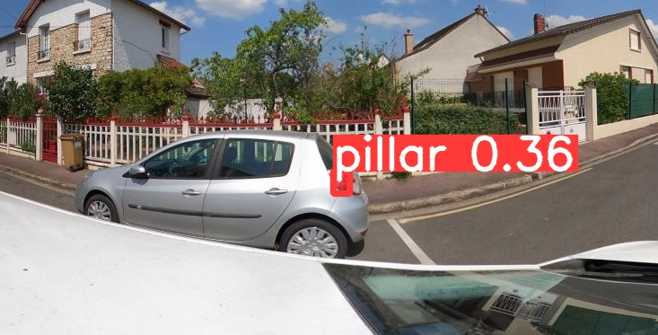

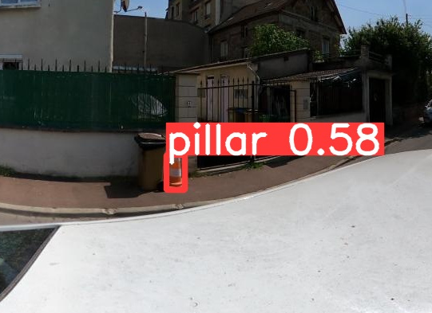

These are called _false positives_ ❌, detections that doesn't match what you're looking for. You may expect many ones in your first version of the model. _No worries_, we will handle that later 😉

Another issue that you can meet is _false negatives_ 👻, pictures that contain a fire hydrant but which are missed by the model. These are harder to find, because no file is downloaded. If you want to identify them, you can rely on the Panoramax API we used in first part to retrieve example pictures. With a reference dataset, you can find all available pictures, and check if they were identified by your model.

## 📈 Improve the model

### Expand the training dataset

In order to limit false positives and false negatives, we will need to broaden our pictures dataset. This can be done using the first run of detections results (in `detected_features_pictures` folder). Look at pictures, and put apart:

- Picture having an object wrongly detected as fire hydrant (traffic cones, car rear light, traffic signs...)
- Picture having a fire hydrant detected with a low confidence score (less than 0.5)

In order to make the model better distinguish fire hydrants and other features, we will create new labels/classes in Label Studio. In this use case, we introduce the following new labels:

- Traffic cones
- Car rear lights
- Red traffic signs
- Red clothes

Go back in Label Studio, and add them in your project settings.

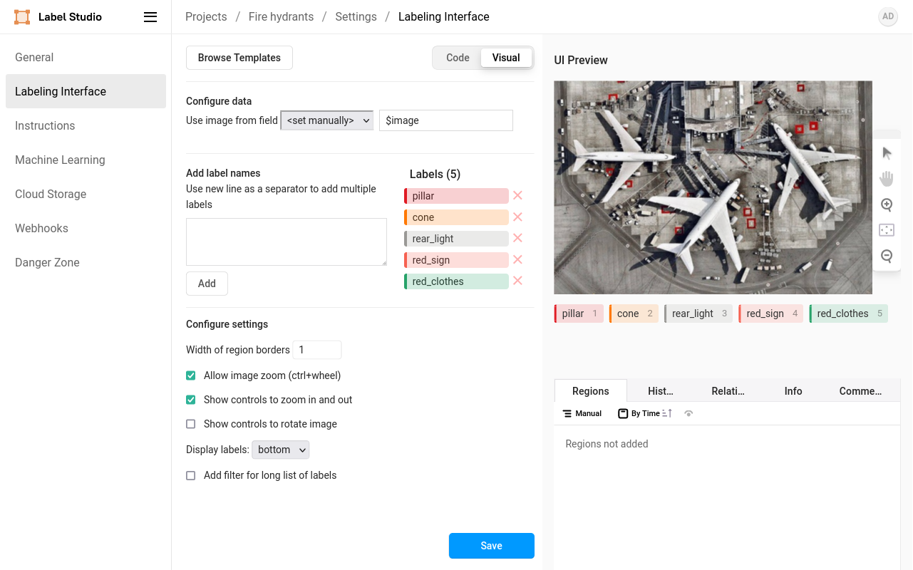

Then, go to the import page, and import the pictures with false negatives or low-confidence detections.

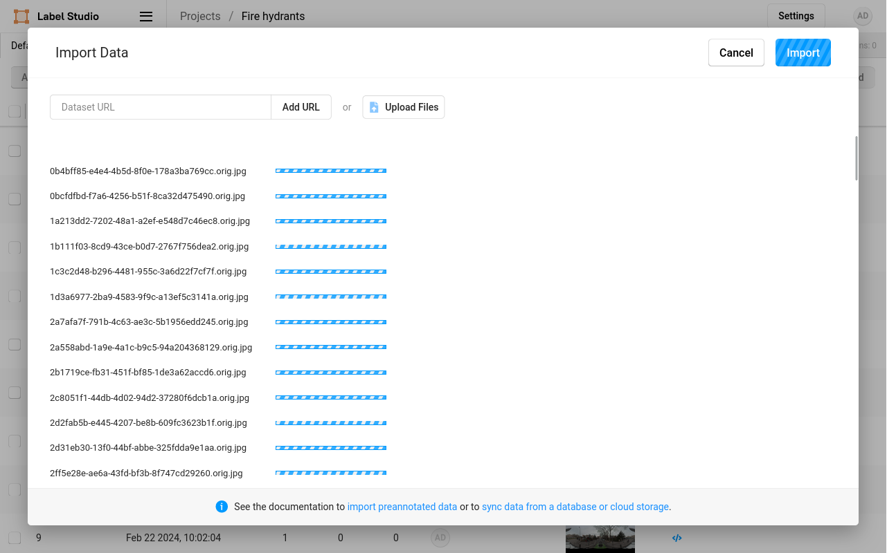

Once pictures are imported, you go back to labelling pictures (yes I know, _boring_ 🙃). You have to :

- Add newly introduced labels in __previously annotated pictures__
- Add all labels in freshly imported pictures

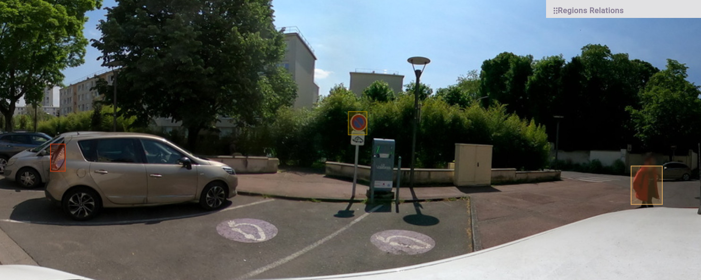

Make sure each class has at least a hundred annotations through the whole set of pictures. If a class is less represented than the others, it will not be as efficient to avoid false positives.

Once you're done, we re-do the export like in first model version. Export in YOLO format and save the generated ZIP file.

### Training the model

Let's train again our model. Like in previous version, we need to split our pictures into a training and a validation dataset. Repeat the 80% / 20% split operation, in order to have a `hydrants_data_v2` folder for training pictures, and `hydrants_data_validation` folder for validation pictures.

And as in first model preparation, we need a `data.yaml` file associated to this new exported dataset. Create it in `hydrants_data_v2` folder, but this time with a content a bit different:

```yaml
train: /path/to/hydrants_data_v2/images
val: /path/to/hydrants_data_validation/images
nc: 5
names: ['cone', 'pillar', 'rearlight', 'redclothes', 'redsign']
```

* `train` and `val`: pointing to the path containing your second version dataset pictures
* `nc`: number of classes
* `names`: the list of classes names, in the same order as in the `hydrants_data_v2/classes.txt` file

Once the configuration file is ready, we can launch the YOLO training again:

```bash
yolo detect train \
	data=./hydrants_data_v2/data.yaml \
	model=yolov8n.pt \
	project=hydrants_model_v2 \
	epochs=100 imgsz=2048
```

After a bit of processing, a new `hydrants_model_v2` folder will be available. This time, we can give a closer look at generated statistics (in `train` sub-folder). For example, let's look at the __Normalized Confusion Matrix__ (`confusion_matrix_normalized.png`). It lists the labels mistaken for another class.

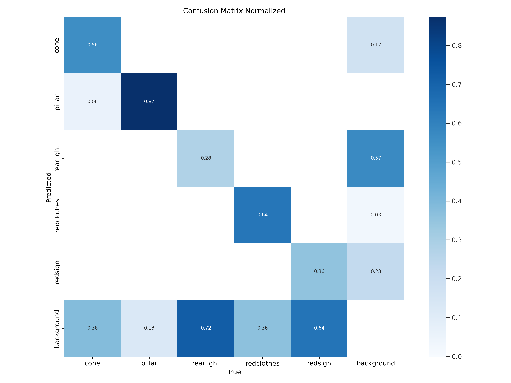

It is readable that way:

- The left / vertical axis is the __predicted class__, what the model think the detected object is
- The bottom / horizontal axis is the __true class__, what is really present in the picture (based on your validation dataset)

The most important thing to read is what happens to pillars from the validation dataset, in particular what's not outcoming as a pillar. On this example matrix, we see:

- 68% of pillars in validation dataset are correctly found as pillars by model (_true positives_)
- 32% of them are not detected by the model (_false negatives_)

This is not extremely good, but not _that bad_ as well. Another metric is _false positives_, things detected as pillars where they're not. Here, no pillar in validation dataset outcomes as a red sign, traffic cone, car rear light... Which is a good news !

[A reference documentation on interpreting these results is available in YOLO docs](https://docs.ultralytics.com/guides/yolo-performance-metrics/).

This data can help you improve your training dataset by targeting the classes you may work on first.

### Running manual prediction

You can re-run your new model manually with the following command:

```bash
yolo predict \
	project=hydrants_model_v2 \
	model=./hydrants_model_v2/train/weights/best.pt \
	source=./Images/pic_with_hydrant.jpg \
	classes=1 \
	imgsz=2048 save_txt=True
```

__Note__ the new parameter `classes=1`, this is important and let the command know that you only want to detect objects corresponding the label with ID 1. It corresponds to the __second__ entry of the classes list in `classes.txt` file (ID are starting at zero). Here, ID 1 corresponds to `pillar`, our fire hydrant label.

### Running automatic detection against Panoramax

You can also run again the `predict_pano.py` script to detect features in a given search area with Panoramax pictures. __Also note here__ that you need to change the class ID parameter, similarly as in manual run:

```python
# Class ID to target in detections
CLASS_ID=1
```

You will get a new batch of detections.

### Continue improving the model

After a second run, you may notice an improvement in results, with fewer false positives or negatives. You can go furthuer on refining your model by repeating these steps:

- Identify false positives or negatives
- Import and annotate in Label Studio
- Eventually create new classes if you find new repeating false positives (for example brick walls confused for fire hydrants)
- Train again the model

When you train again your model, you may set the `model` parameter differently:

- If you keep same classes as previous iteration, model can be set to your last `best.pt` file
- If you change list of classes, model should be set to a YOLO default model (here `yolov8n.pt`)

When you're confident enough in your model, you may also add a `conf=0.5` parameter in your manual predictions or in the `predict_pano.py` script. The confidence parameters will only keep detections with a confidence score higher than the set value, avoid _noise_ in results.

Another setting that can help on improving the results is `imgsz`. We saw that it should match your pictures width. But switching to lower values can help detecting objects in the foreground (too big to be recognized), and switching to higher values can help detecting objects in the background (too small to be recognized).

## 👋 Conclusion

To conclude this tutorial, you saw the whole potential behind object detection using YOLOv8 tooling. Panoramax and OpenStreetMap combined helped us having easily a training dataset. Label Studio helped us by offering an easy-to-use user interface to label pictures. All of this offer a powerful ecosystem to detect on a large scale all objects you'd like.

The Panoramax team is here to help you, you can come discuss with us on:

- [Forum des Géocommuns](https://forum.geocommuns.fr/c/panoramax/6), don't hesitate to open a topic here, forum is originally in 🇫🇷 French but feel free to start a discussion in 🇬🇧 English 😊
- Email at [panoramax@panoramax.fr](mailto:panoramax@panoramax.fr)

## 📰 License

© Copyright Panoramax team 2024

This work is licensed under a
[Creative Commons Attribution-ShareAlike 4.0 International License]([cc-by-sa]).

[![CC BY-SA 4.0][cc-by-sa-image]][cc-by-sa]

[cc-by-sa]: http://creativecommons.org/licenses/by-sa/4.0/
[cc-by-sa-image]: https://licensebuttons.net/l/by-sa/4.0/88x31.png
